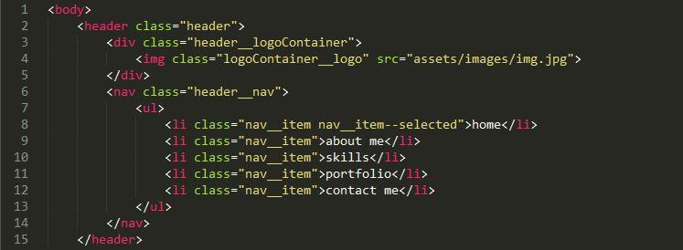
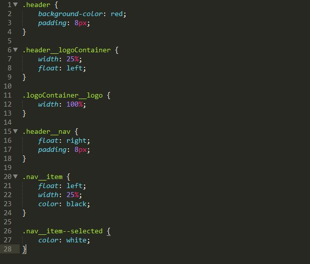

## BEM
### 1.名字意思
&nbsp;&nbsp;```B```代表块(```Block```),```E```代表元素(```Element```),```M```代表修饰符(```Modifier```)

### 2.命名规则
&nbsp;&nbsp;``BEM``的命名规则：```block-name_element-name--modifier-name```,即模块名+元素名 +修饰器名

### 3.解决思路
&nbsp;&nbsp;```BEM```解决思路：在项目开发中，每一个组件都是独一无二的，其名字也是独一无二的的，组件内部元素的名字都加上组件名，并用元素的名字作为选择器，自然组件内的样式就不会与组件外的样式冲突了。（通过组件的唯一性来保证选择器的唯一性，从而保证样式不会污染到组件外）

### 4.例子
&nbsp;&nbsp;分页组件``` /app/components/page-btn```，那么该组件的模块就名为```page-btn```，组件内部的元素命名都必须加上模块名
如：

```javascript
<div class='page-btn'>
 <button class='page-btn_prev'>上一页</button>
 <button class='page-btn_next'>下一页</button>
  </div>
```

#### 5.不正确的命名：
```javascript
<div class='page-btn' > 
<ul class='page-btn_list'> 
<li class='page-btn_list-item'>
<a href='#' class='page-btn_list_item_link>第一页</a>
</li>
</ul>
</div>
```
### 6.注意
- 1.```BEM```的命名中包含三个部分，元素名只占其中一部分，不能出现多个元素名的情况（应该是后续的命名不能包含前面命名的元素名（自个取得有含义的名字））
- 2.```BEM```是不考虑结构的，如上面的例子中，分页按钮即使在```ul```列表中，它的命名也不应该考虑其父级元素。所以规定，无论父元素名发生改变，或者模块构造发生改变，还是元素之间层级关系互相变动，这些都不会影响元素的名字

#### 7.关于上面的第二个例子的不正确的个人理解
&nbsp;&nbsp;有```BEM```是由块,元素和修饰符组成的,也就是说,由这三部分连接(或者不要修饰符)组成,但通过多个的_下划线来连接来作为BEM中的元素时,其每一个部分看起来很不明确,容易混乱.
&nbsp;&nbsp;其次,我们要指定,```BEM```的目的是通过提供清晰的结构来消除混乱和类名的无助感。当你用多个下划线的话,意思上得以联通,但是从BEMde构造规则和目的来说,是不符合规定的



可以看到,这些命名是按照三个独立部分书写的(或许不是很由说服力)


### 8.BEM禁止使用子选择器
#### 原因
- 1.新来程序员接手项目，要增加一个需求，新增一个需求，命名可能有冲突（项目多了，检查新组件名是否和以往组件的子元素命名冲突就很麻烦）
- 2.使用子代选择器，层次关系过长，逻辑不清晰，不利于维护
- 3.子代选择器会造成权重问题（因为```css```的权重是累加的），当需要做响应式时，某个带样式的元素需要适配不同的屏幕，此时需要不断取人该元素之前的选择器写法，为了覆盖前面权重过大的样式，甚至添加额外的类名或标签名来增加权重，造成维护难度越来越大）
##### 补充
如果我们用的是BEM，要覆盖样式很简单：找到要覆盖样式的元素，得知它的类名，在媒体查询中，用它的类名作为选择器，写下覆盖样式，样式就覆盖成功了，不需要担心前面样式的权重过大

### 9.BEM修饰器
1.```BEM```中修饰器的样式不依赖于任何结构关系，所以元素的状态改变不会影响滋生，不影响其他元素
2.```BEM```修饰器代表着元素的状态
&nbsp;&nbsp;推荐写法（如激活状态）
```javascript
.block_element{display:none}
.block_element--active{dispaly:block}
```
#### 补充
如是使用```js```为元素添加状态时，能推导出激活状态类名为.```block_element--active```，不合理，所以得统一```js```控制状态类名格式，如```is-active```或```js-active```

### 11.原子类
个人理解：就是可以公用的类，类似于```vue```中的混入或者```scss```中的```@extend```引用，即可公用的部分
如果项目变动大且不可复用(一般针对组件),可以使用原子类(可以配合```BEM```),但是如果是相反的话,则推荐使用```BEM```,因为对于一个组件来说,本身应该是'自洽'的,即本身就应该构成一个'生态圈',不需要供给,就能自给自足的运转下去(也许就像```BFC```一样是一个独立的块,不受外部干扰)

### 12.BEM命名过长的解决
使用```webpack```打包时,在配置文件中加入```css-loader```来处理```css```样式,给元素的名称加入唯一的标识