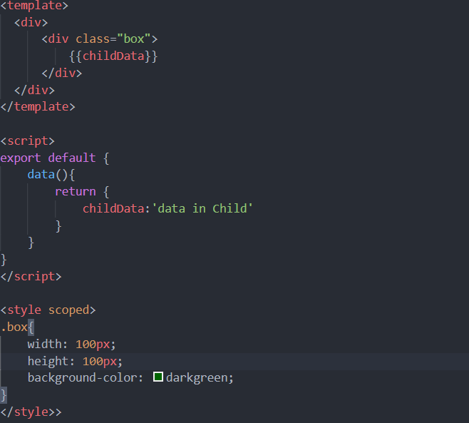
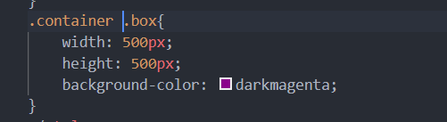
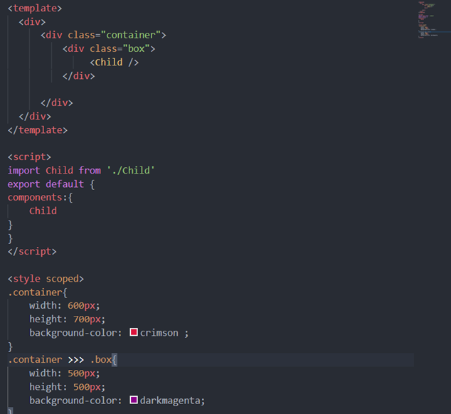
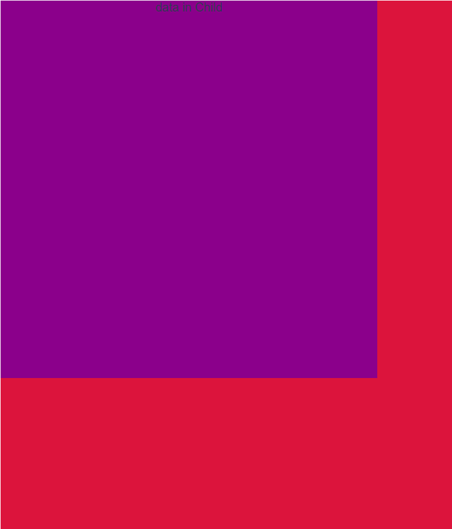

# 茂姐ppt总结
## 1.样式穿透
在vue中的style中,有一个scoped属性,表示本次书写的css样式只在本组件生效,其子组件是无法继承这个css样式的,所以子组件要想继承父组件的样式,一般使用样式穿透
使用方式:在需要继承子组件中的继承的类的前面使用``` /deep/```,或者```>>>```,或者```::v-deep```
(注:如果是要css预处理,如在less,sass(scss)中使用样式穿透,css预处理器无法识别 ```>>>```,可以使用```/deep/```或```::v-deep```代替)
### 实例
未使用样式穿透的代码片段

未使用样式穿透的父组件代码片段

未使用样式穿透的效果图

添加上样式穿透

添加上样式穿透的效果图
